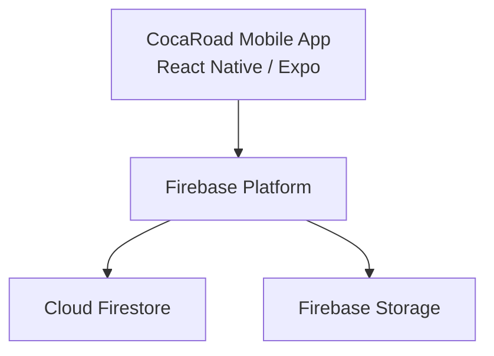
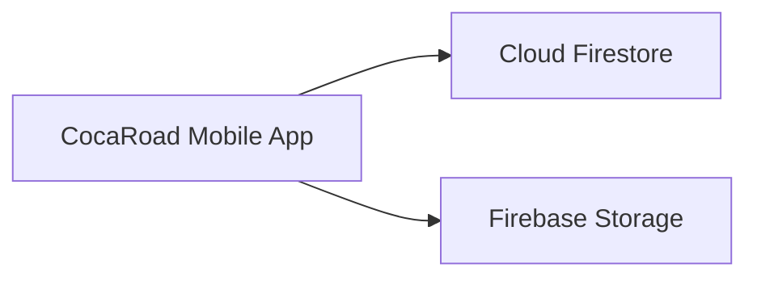
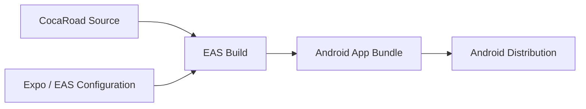
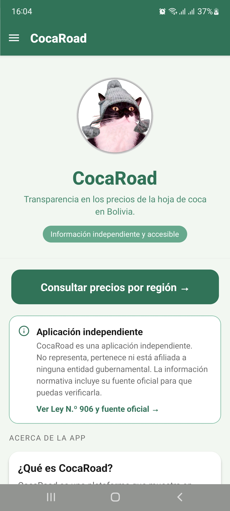
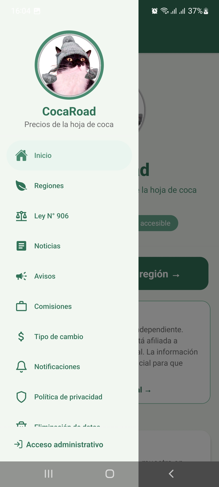
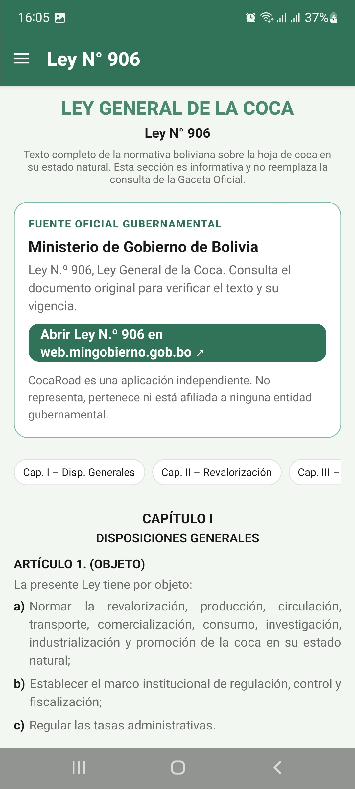
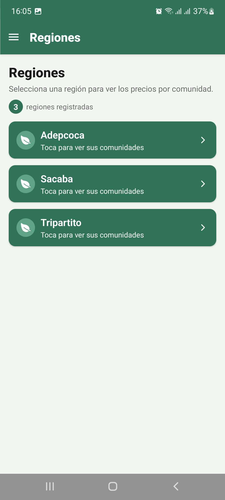
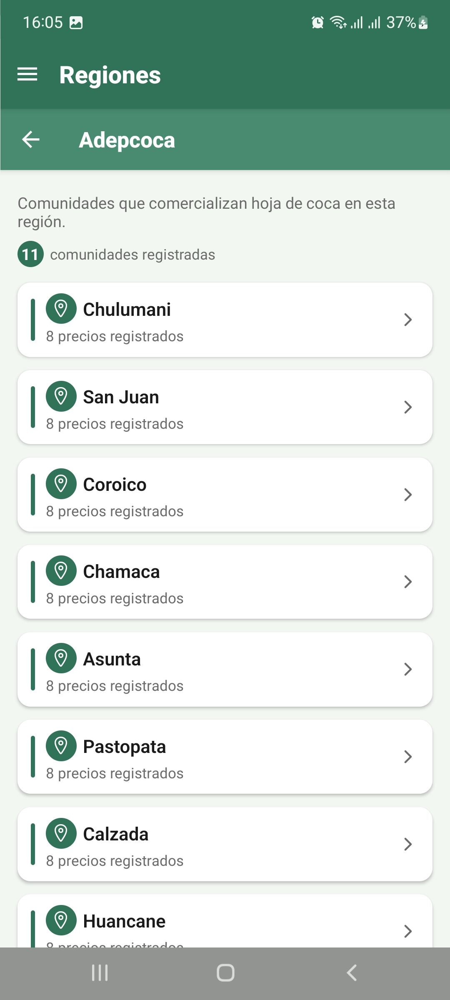

# CocaRoad — Mobile Application & Technical Evolution

Technical case study of a mobile application for coca-leaf price information in Bolivia, covering its product architecture, Firebase-based data layer, mobile functionality, technical evolution and production-readiness work.

> **Source code notice**
>
> This repository contains technical documentation, architecture and selected visual material only.
> The production source code is private and is not included in this repository.

---

## Contents

- [Overview](#overview)
- [The Product](#the-product)
- [My Role](#my-role)
- [Technology Stack](#technology-stack)
- [Product Architecture](#product-architecture)
- [Core Product Functionality](#core-product-functionality)
- [Development Approach](#development-approach)
- [Firebase Architecture](#firebase-architecture)
- [Application Evolution](#application-evolution)
- [Modernization Work](#modernization-work)
- [Production Readiness](#production-readiness)
- [Security & Operational Review](#security--operational-review)
- [Build & Release Pipeline](#build--release-pipeline)
- [Engineering Decisions](#engineering-decisions)
- [Technical Challenges](#technical-challenges)
- [Implementation Status](#implementation-status)
- [Platform Screenshots](#platform-screenshots)
- [What This Project Demonstrates](#what-this-project-demonstrates)
- [Key Takeaways](#key-takeaways)
- [Repository Scope](#repository-scope)
- [Author](#author)

---

## Overview

CocaRoad is a mobile application designed to provide accessible information about coca-leaf prices in Bolivia.

The platform organizes price information by region and community, allowing users to navigate from a geographic area to specific communities and consult registered prices for different coca-leaf categories.

In addition to price consultation, the application includes supporting information such as legal references, news, notices, commissions, exchange-rate information, notifications and privacy-related functionality.

From a technical perspective, CocaRoad is built as a React Native / Expo mobile application backed by Firebase services for cloud data and storage.

Over time, the application has also gone through a technical modernization process to remain compatible with newer versions of Expo, React Native and Android platform requirements.

This case study documents both the product architecture and that technical evolution.

---

## The Product

CocaRoad is a mobile-first application focused on making coca-leaf price information easier to consult and understand.

The application organizes information hierarchically by:

```text
Region
   ↓
Community
   ↓
Coca-leaf categories
   ↓
Registered prices
```

This structure allows users to navigate from a broader geographic area to specific communities and then consult the latest registered price information.

The product also includes complementary informational and operational modules such as:

- Regional price consultation
- Community-level price information
- Legal and normative information
- News
- Notices
- Commissions
- Exchange-rate information
- Notifications
- Privacy information
- Data-deletion options
- Administrative access

The application is designed around a simple principle:

> Present useful information through a clear mobile experience without requiring users to understand the underlying data structure.

---

## My Role

My work on CocaRoad covered both the initial development of the mobile application and its subsequent technical evolution.

Responsibilities included:

- Mobile application architecture
- UI implementation and navigation flows
- Firebase and Firestore integration
- Data modeling
- Regional and community price workflows
- Information and legal modules
- Administrative access workflows
- Notification-related functionality
- TypeScript configuration
- Android compatibility
- Expo and React Native modernization
- Dependency management
- EAS Build configuration
- Production-readiness review
- Security and operational assessment

---

## Technology Stack

### Mobile

- React Native `0.81.x`
- Expo SDK `54`
- React `19`
- TypeScript
- Hermes
- Android

### Cloud Services

- Firebase
- Cloud Firestore
- Firebase Storage

### Delivery

- Expo Application Services
- EAS Build
- Android application bundles
- Environment-based configuration

### Development Quality

- TypeScript strict mode
- Static type validation
- Dependency compatibility review
- Expo diagnostics
- Production configuration review

---

## Product Architecture

CocaRoad uses a mobile + Firebase architecture.



The mobile application contains the user experience and product workflows, while Firebase provides cloud persistence and storage capabilities.

This architecture keeps the infrastructure lightweight while supporting the application's data and content requirements.

---

## Core Product Functionality

### Regional Price Consultation

The main application flow allows users to browse registered regions and access their associated communities.

```text
Regions
   ↓
Communities
   ↓
Price Detail
```

This keeps the information hierarchy understandable while avoiding overloaded screens.

### Community Price Detail

Each community can expose multiple coca-leaf categories with their corresponding registered prices.

The price-detail interface also includes update information so users can understand the recency of the displayed data.

### Legal Information

CocaRoad includes contextual information related to **Law N.° 906 — General Law of Coca**.

The application presents this material as informational content and links users back to the corresponding official source for verification.

### Additional Information Modules

The broader application includes sections for:

- News
- Notices
- Commissions
- Exchange-rate information
- Notifications
- Privacy
- Data-deletion options

These modules extend the product beyond a single price-list screen and create a more complete information experience.

---

## Development Approach

The application was built as a complete mobile product rather than as a prototype.

The development process involved several layers:

```text
User Needs
    ↓
Information Structure
    ↓
Mobile UX
    ↓
Application Logic
    ↓
Firebase Data Model
    ↓
Cloud Integration
    ↓
Android Delivery
```

This required decisions across both product and engineering concerns.

Examples include:

- How price data should be grouped
- How users should navigate regions and communities
- Which information belongs in Firestore
- How mobile screens should consume and present cloud data
- How supporting information should be structured
- How the application should evolve without breaking existing functionality

---

## Firebase Architecture

Firebase is central to CocaRoad's cloud architecture.



### Cloud Firestore

Firestore provides the application's main cloud data layer.

It supports product areas such as:

- Regional information
- Communities
- Price records
- Supporting application data
- Operational content

Important engineering considerations include:

- Collection structure
- Query patterns
- Read and write permissions
- Indexes
- Data validation
- Cost control
- Environment separation

### Firebase Storage

Firebase Storage supports file and asset persistence where required by the application.

Production considerations include:

- Upload permissions
- Download permissions
- Path structure
- File ownership
- File-size restrictions
- Access rules

Because the mobile client interacts directly with Firebase services, data-access rules are part of the application architecture rather than a secondary configuration detail.

---

## Application Evolution

CocaRoad has evolved through two main technical stages.

### Initial Product Development

The first stage focused on establishing the product structure and its core mobile functionality.

```text
Product Structure
        ↓
Mobile UI
        ↓
Navigation
        ↓
Firebase Data Layer
        ↓
Price Workflows
        ↓
Information Modules
        ↓
Android Application
```

### Technical Modernization

As the mobile ecosystem evolved, the application required updates to remain compatible with newer framework and Android requirements.

```text
Existing Product
        ↓
Technical Audit
        ↓
Expo / React Native Upgrade
        ↓
Dependency Alignment
        ↓
Android Compatibility
        ↓
Firebase Review
        ↓
EAS Build Validation
        ↓
Production Hardening
```

This progression illustrates a common part of the software lifecycle: maintaining an existing product while its underlying technology continues to evolve.

---

## Modernization Work

The modernization process focused on keeping CocaRoad technically sustainable.

### Framework Modernization

The mobile foundation was aligned with:

```text
Expo SDK 54
React Native 0.81.x
React 19
TypeScript
Hermes
Android
```

The upgrade required validating compatibility between:

- Expo
- React Native
- React
- Native packages
- Android build requirements
- Existing application behavior

### Dependency Compatibility

Expo applications depend on a coordinated dependency ecosystem.

Modernization therefore required more than simply updating package versions individually.

Each change had to preserve compatibility with the broader application stack.

### TypeScript Validation

The project uses TypeScript strict mode.

Maintaining strict typing during modernization helps detect:

- Broken assumptions
- Invalid property access
- Interface mismatches
- Dependency API changes
- Refactoring regressions

The application passed static TypeScript validation during the technical review.

### Android Compatibility

The modernization also included work to keep the application aligned with current Android requirements.

This included reviewing:

- Target API compatibility
- Build tooling
- Native package behavior
- Runtime compatibility
- Production build requirements

---

## Production Readiness

The modernization phase also included an explicit production-readiness review.

A successful development build is only one part of that process.

| Area | Assessment |
|---|---|
| Product functionality | Implemented |
| Mobile architecture | Implemented |
| Firebase integration | Implemented |
| Expo SDK foundation | Modernized |
| React Native foundation | Modernized |
| TypeScript validation | Ready |
| Android compatibility | Updated / validated |
| Firebase production security | Requires final hardening |
| Operational Firebase configuration | Requires validation |
| EAS production configuration | Requires final validation |
| Release pipeline | Requires final production setup |

This separation helps avoid treating compilation success as equivalent to production readiness.

---

## Security & Operational Review

Firebase reduces infrastructure overhead, but production security still depends on carefully designed configuration.

Important review areas include:

```text
Firebase Security
│
├── Firestore access rules
├── Storage access rules
├── Environment configuration
├── Data-access boundaries
├── Client-visible configuration
└── Operational ownership
```

Potential production risks can appear if:

- Firestore rules are too permissive
- Storage permissions are too broad
- Development and production environments are mixed
- Credentials are handled incorrectly
- Operational responsibility is unclear

For this reason, security and operational configuration are treated as part of the product lifecycle.

---

## Build & Release Pipeline

CocaRoad uses Expo Application Services as the foundation for Android builds.



A production release workflow should guarantee that:

- Build configuration is versioned
- Build profiles are explicit
- Application versions are controlled
- Production credentials are managed safely
- Builds are reproducible
- Store artifacts can be generated consistently

This work complements the product development itself by making delivery more predictable.

---

## Engineering Decisions

### Build the Product Around the Information Hierarchy

CocaRoad's main navigation reflects the structure of its data.

```text
Region → Community → Price
```

This reduces cognitive load and keeps the mobile experience simple.

### Use Firebase for a Lightweight Cloud Architecture

Firebase provides cloud persistence without requiring a separate backend infrastructure for the application's current scope.

This keeps the architecture relatively simple while supporting the product's data requirements.

### Keep TypeScript Strict

Strict typing improves confidence when evolving the application.

It became especially valuable during later framework and dependency upgrades.

### Preserve Product Behavior During Modernization

Modernization was approached as an evolution of the existing product rather than a rewrite.

The priority was:

```text
Preserve Functionality
        +
Upgrade the Technical Foundation
        +
Reduce Maintenance Risk
        +
Improve Release Readiness
```

### Treat Firebase Rules as Backend Security

Because the mobile client communicates directly with Firebase, Firestore and Storage rules act as an important part of the application's security boundary.

### Separate Product Development from Production Hardening

The application can be functionally complete while some operational concerns still require final production validation.

Keeping these concerns separate makes technical status more transparent.

---

## Technical Challenges

### Designing a Clear Mobile Information Flow

The product needed to expose multiple layers of price information without making navigation confusing.

The region → community → price model provided a simple solution that maps naturally to the domain.

### Building Around Cloud Data

The application needed to transform Firebase records into a mobile experience that remained understandable and responsive.

This required careful data modeling and UI-state management.

### Maintaining an Application Over Time

A product's technical work does not stop after its first successful version.

Expo, React Native, Android and dependencies continue to evolve.

CocaRoad therefore required both initial development and later technical maintenance.

### Dependency Modernization

Updating a React Native / Expo ecosystem can affect:

- Native packages
- Runtime behavior
- Build configuration
- Permissions
- Android requirements
- Existing application APIs

Modernization needed to avoid regressions while moving the project forward.

### Firebase Security

Direct client access to Firebase services simplifies the architecture but makes rules and access boundaries critical.

### Production Configuration

Production readiness also requires clear handling of:

- Build profiles
- Credentials
- Application versions
- Release signing
- Environment configuration
- Store artifacts

---

## Implementation Status

| Component | Status | Direction |
|---|---|---|
| Product architecture | Implemented | Maintain and evolve |
| Mobile application | Implemented | Continue feature evolution |
| Regional price workflow | Implemented | Maintain |
| Community price workflow | Implemented | Maintain |
| Legal information module | Implemented | Maintain source accuracy |
| Firebase integration | Implemented | Continue security hardening |
| Firestore | Active | Validate production security and indexes |
| Firebase Storage | Active | Validate production access rules |
| Expo SDK | Modernized | Maintain supported versions |
| React Native | Modernized | Maintain compatibility |
| TypeScript | Strict / validated | Preserve strict validation |
| Android compatibility | Updated | Maintain platform requirements |
| EAS Build | Available | Finalize reproducible production configuration |
| Production hardening | Ongoing | Complete final operational validation |

---

## Platform Screenshots

The following screenshots show selected CocaRoad mobile workflows and product functionality.

### Home & Navigation

<p align="center">
  
  
</p>

The home screen presents the application's main purpose and provides direct access to price consultation by region.

The navigation drawer exposes the broader product structure, including regional consultation, legal information, news, notices, commissions, exchange-rate information, notifications, privacy options and administrative access.

---

### Legal Information

<p align="center">
  
</p>

CocaRoad includes contextual legal information related to Bolivia's **Law N.° 906 — General Law of Coca**, together with a reference to its official source.

The legal section is presented as informational content and directs users to the corresponding official source for verification.

---

### Regional Price Navigation

<p align="center">
  
  
</p>

The main consultation flow is organized hierarchically.

Users first select a registered region and then browse the communities associated with that region.

```text
Region
   ↓
Community
   ↓
Registered prices
```

---

### Community Price Detail

<p align="center">
  
</p>

The price-detail view presents the latest registered values for the different coca-leaf categories available in a selected community.

The screenshot used in this public case study has been sanitized to avoid exposing internal identifiers.

---

## What This Project Demonstrates

CocaRoad demonstrates experience across the lifecycle of a mobile product:

`Product Development`

`Mobile Architecture`

`React Native`

`Expo`

`TypeScript`

`Firebase`

`Cloud Firestore`

`Firebase Storage`

`Android`

`Data Modeling`

`Mobile UX`

`Technical Auditing`

`Software Modernization`

`Production Readiness`

`Security Review`

`EAS Build`

`Release Engineering`

The project combines product development with the later technical work required to keep a mobile application maintainable as frameworks, dependencies and platform requirements evolve.

---

## Key Takeaways

Some of the main engineering lessons from CocaRoad include:

- Building a product and maintaining it are different engineering responsibilities.
- Mobile architecture should reflect the way users naturally understand the data.
- Firebase can provide an effective cloud foundation when access boundaries are designed carefully.
- Strict TypeScript improves confidence during both development and modernization.
- Expo and React Native dependencies must be treated as a coordinated ecosystem.
- Android platform requirements continue evolving after the initial application release.
- Modernization should preserve working product behavior whenever possible.
- Firebase security rules are part of the application architecture.
- A successful build does not automatically mean an application is production-ready.
- Production delivery should be reproducible and documented.
- The lifecycle of a real application extends from initial development through maintenance, modernization and release engineering.

---

## Repository Scope

This repository intentionally does **not** contain:

- Production source code
- Firebase credentials
- Firebase configuration secrets
- Environment variables
- Production Firestore data
- Production Storage files
- Signing credentials
- Android keystores
- Internal build credentials
- Private operational information

Its purpose is exclusively to document the product architecture, development work, modernization process, engineering decisions and technical lessons learned.

---

## Author

**Alfredo Ramos**

Software Engineer  
Full Stack · Mobile · Backend · Data · GIS · Machine Learning

GitHub: [@wolcken](https://github.com/wolcken)  
LinkedIn: [alfredoramos-dev](https://www.linkedin.com/in/alfredoramos-dev/)
