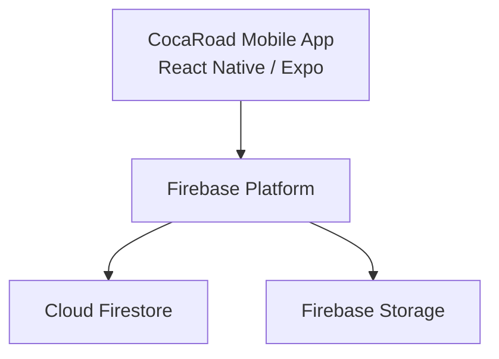
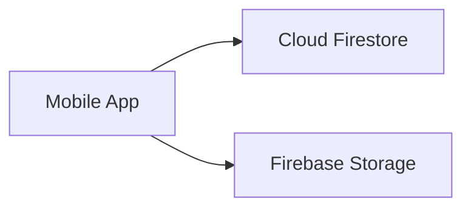
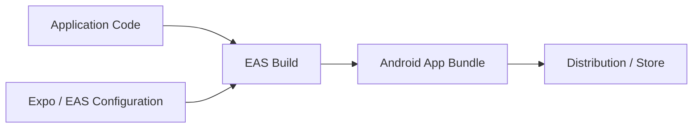

# CocaRoad — Mobile Application Modernization & Production Readiness

Technical case study of the audit, modernization and production-readiness process of an existing mobile application built with React Native, Expo and Firebase.

> **Source code notice**
>
> This repository contains technical documentation, architecture and selected visual material only.
> The production source code is private and is not included in this repository.

---

## Contents

- [Overview](#overview)
- [The Product](#the-product)
- [My Role](#my-role)
- [Technology Stack](#technology-stack)
- [Initial Technical Assessment](#initial-technical-assessment)
- [Architecture](#architecture)
- [Modernization Strategy](#modernization-strategy)
- [Mobile Foundation](#mobile-foundation)
- [Firebase Architecture](#firebase-architecture)
- [Production Readiness](#production-readiness)
- [Security & Operational Review](#security--operational-review)
- [Build & Release Pipeline](#build--release-pipeline)
- [Engineering Decisions](#engineering-decisions)
- [Technical Challenges](#technical-challenges)
- [Implementation Status](#implementation-status)
- [Platform Screenshots](#platform-screenshots)
- [What This Project Demonstrates](#what-this-project-demonstrates)
- [Key Takeaways](#key-takeaways)
- [Repository Scope](#repository-scope)
- [Author](#author)

---

## Overview

CocaRoad is a mobile application designed around access to coca-leaf price information.

The project already existed when the modernization work began, so the engineering challenge was not to build a new application from zero.

The goal was to evaluate the existing codebase, modernize its mobile foundation, validate compatibility with current Android requirements, review Firebase usage and prepare the project for a safer and more maintainable production workflow.

This case study focuses on that process.

The main engineering areas included:

- Technical audit
- Dependency modernization
- Expo and React Native compatibility
- Android production requirements
- TypeScript validation
- Firebase integration review
- Build configuration
- Security assessment
- Release readiness
- Maintainability improvements

---

## The Product

CocaRoad is a mobile application focused on presenting and managing coca-leaf price information through a mobile-first experience.

The application uses Firebase services as its cloud data layer and is designed to support access to up-to-date information from Android devices.

From an engineering perspective, the project represents a common real-world scenario:

> A mobile application can continue working while its technical foundation becomes increasingly difficult to maintain.

Modernization therefore becomes necessary not because the product has failed, but because the surrounding ecosystem continues to evolve.

Android requirements change.

Expo and React Native evolve.

Dependencies introduce new compatibility requirements.

Cloud configuration needs to be reviewed.

Build pipelines need to become reproducible.

Production readiness requires more than a successful local build.

---

## My Role

My work on CocaRoad focused on technical assessment and modernization of the existing application.

Responsibilities included:

- Reviewing the existing project architecture
- Auditing Expo and React Native compatibility
- Validating TypeScript configuration
- Reviewing Firebase integration
- Identifying production risks
- Updating the mobile technical foundation
- Preparing Android compatibility
- Reviewing build and release configuration
- Evaluating EAS Build readiness
- Identifying security and operational concerns
- Defining remaining production requirements
- Improving maintainability and deployment readiness

The project demonstrates work with an existing codebase where preserving functionality is as important as introducing technical improvements.

---

## Technology Stack

### Mobile

- React Native `0.81.x`
- Expo SDK `54`
- React `19`
- TypeScript
- Hermes
- Android

### Cloud Services

- Firebase
- Cloud Firestore
- Firebase Storage

### Delivery

- Expo Application Services
- EAS Build
- Android application bundles
- Environment-based configuration

### Development Quality

- TypeScript strict mode
- Static type validation
- Dependency compatibility review
- Expo diagnostics
- Production configuration review

---

## Initial Technical Assessment

Before making structural changes, the application was reviewed in a read-only audit.

The audit focused on answering several questions:

```text
Can the project compile cleanly?
        ↓
Are the framework versions compatible?
        ↓
Does the project meet current Android requirements?
        ↓
Are Firebase services configured safely?
        ↓
Can production builds be reproduced?
        ↓
Is the project operationally ready for publication?
```

The assessment showed that the project had a solid base but still required production hardening.

### Positive findings

- Modern Expo foundation
- React Native compatible with the selected Expo SDK
- TypeScript strict mode enabled
- Static TypeScript validation completed successfully
- Firebase already integrated
- Android build path available
- Project structurally close to release readiness

### Main risks identified

- Firebase security and operational configuration
- Production release configuration
- Build pipeline consistency
- Environment and credential handling
- Final production validation

This distinction was important:

> A project that builds successfully is not automatically production-ready.

---

## Architecture

At a high level, CocaRoad follows a mobile + Firebase architecture.



The mobile client is responsible for the user experience while Firebase provides cloud persistence and storage capabilities.

The architecture is intentionally simple, but that simplicity also means Firebase rules and operational configuration become especially important.

---

## Modernization Strategy

The modernization process was approached progressively.

```text
Existing Application
        ↓
Technical Audit
        ↓
Compatibility Review
        ↓
Framework Modernization
        ↓
Android Requirements
        ↓
Firebase Review
        ↓
Build Pipeline Review
        ↓
Production Hardening
```

The goal was not to rewrite a working application unnecessarily.

Instead, the strategy focused on preserving product functionality while updating the parts of the system that could create future maintenance or publication problems.

---

## Mobile Foundation

The mobile application was aligned with a modern Expo and React Native stack.

### Current foundation

```text
Expo SDK 54
React Native 0.81.x
React 19
TypeScript
Hermes
Android
```

The project also uses TypeScript strict mode.

This is valuable in an existing application because modernization often exposes problems that were previously hidden by weaker typing or outdated dependencies.

Static type validation helps detect:

- Incorrect assumptions
- Invalid property access
- Broken interfaces
- Dependency API changes
- Refactoring errors

The project passed TypeScript validation during the technical audit.

---

## Firebase Architecture

Firebase is central to the current application architecture.

The application uses cloud services for data and storage.



### Firestore

Firestore provides the application's cloud data layer.

Important production considerations include:

- Collection structure
- Read and write permissions
- Query patterns
- Indexes
- Validation rules
- Cost control
- Environment separation

### Firebase Storage

Firebase Storage provides file and asset persistence.

Production review must consider:

- Upload permissions
- Download permissions
- File ownership
- Path structure
- File size constraints
- Content validation
- Access rules

---

## Production Readiness

One of the most important conclusions of the audit was that production readiness must be evaluated independently from compilation success.

| Area | Assessment |
|---|---|
| Mobile framework compatibility | Ready |
| TypeScript validation | Ready |
| Expo SDK foundation | Ready |
| React Native foundation | Ready |
| Android compatibility | Ready / validated |
| Firebase integration | Functional |
| Firebase production security | Requires hardening |
| Operational Firebase configuration | Requires validation |
| EAS production configuration | Requires final validation |
| Release pipeline | Requires final production setup |

This case study intentionally does not present unfinished work as completed work.

---

## Security & Operational Review

Firebase makes it possible to create mobile applications quickly, but production security depends heavily on configuration.

A technically functional integration can still expose unnecessary risk if:

- Firestore rules are too permissive
- Storage rules allow unauthorized access
- Development and production environments are mixed
- Credentials are handled incorrectly
- Operational ownership is unclear

For this reason, Firebase review was treated as a production requirement rather than an optional improvement.

### Security areas reviewed

```text
Firebase Security
│
├── Firestore access rules
├── Storage access rules
├── Environment configuration
├── Client-visible configuration
├── Data access boundaries
└── Operational ownership
```

The primary lesson is simple:

> Managed cloud services reduce infrastructure work, but they do not remove the need for security engineering.

---

## Build & Release Pipeline

A production mobile project should have a repeatable release process.

CocaRoad uses Expo Application Services as the foundation for its Android build pipeline.



The release workflow needs to guarantee that:

- Build configuration is versioned
- Production environments are clearly defined
- Application versions are controlled
- Credentials are managed safely
- Builds can be reproduced
- Store artifacts are generated consistently

A local development build is useful for validation, but the production pipeline must be considered separately.

---

## Engineering Decisions

### Audit Before Modernization

Before changing framework versions or dependencies, the existing project was evaluated.

This reduces unnecessary changes and helps identify the actual source of technical risk.

### Preserve a Working Product

The modernization strategy avoids rewriting the application simply because newer technologies exist.

```text
Preserve Functionality
        +
Improve Maintainability
        +
Meet Platform Requirements
        +
Reduce Production Risk
```

### Keep TypeScript Strict

Strict typing is valuable in modernization work because framework updates often reveal hidden assumptions.

Maintaining strict TypeScript configuration helps make changes safer.

### Treat Firebase Configuration as Application Architecture

Firestore and Storage are not secondary implementation details.

Because the mobile client interacts directly with Firebase services, security rules are effectively part of the backend architecture.

### Separate Development Readiness from Production Readiness

A project can launch locally, pass type checking and generate a development build while still requiring production work.

This distinction is central to this project.

### Make Releases Reproducible

A production application should not depend on a developer remembering undocumented steps.

The release process should be represented through configuration and repeatable workflows.

---

## Technical Challenges

### Updating an Existing Mobile Codebase

Modernization requires balancing two goals:

- introducing technical improvements;
- avoiding regressions in existing behavior.

Framework upgrades can affect navigation, native modules, permissions, UI behavior, Android configuration and package compatibility.

### Dependency Compatibility

Expo projects depend on a coordinated set of package versions.

Updating dependencies independently can introduce incompatibilities.

### Android Platform Evolution

Android publishing requirements change over time.

Applications must remain compatible with current Android API levels, build tools, native dependency requirements, runtime behavior and store policies.

### Firebase Security

Firebase allows the client to interact directly with cloud services.

This simplifies architecture, but increases the importance of properly designed rules.

Security cannot depend only on the mobile interface.

### Production Configuration

Production requires clear decisions around environments, credentials, release signing, build profiles, versioning, data access, monitoring and ownership.

---

## Implementation Status

| Component | Status | Direction |
|---|---|---|
| Mobile application | Existing / active | Continue modernization |
| Expo SDK | Modernized | Maintain supported versions |
| React Native | Modernized | Maintain compatibility |
| TypeScript | Strict / validated | Preserve strict validation |
| Android compatibility | Updated | Maintain store requirements |
| Firebase integration | Active | Continue hardening |
| Firestore | Active | Validate production security and indexes |
| Firebase Storage | Active | Validate production security |
| EAS Build | Available | Finalize reproducible production configuration |
| Production release | Preparation | Complete security and operational validation |

---

## Platform Screenshots

> Selected screenshots can be added without exposing private client information, internal configuration or sensitive production data.

### Application Home

<!--
<p align="center">
  
</p>
-->

### Price Information

<!--
<p align="center">
  
</p>
-->

### Price Detail

<!--
<p align="center">
  
</p>
-->

### Application Navigation

<!--
<p align="center">
  
</p>
-->

### Additional Workflow

<!--
<p align="center">
  
</p>
-->

---

## What This Project Demonstrates

CocaRoad demonstrates experience across several areas of mobile software engineering:

`React Native`

`Expo`

`TypeScript`

`Firebase`

`Cloud Firestore`

`Firebase Storage`

`Android`

`EAS Build`

`Technical Auditing`

`Software Modernization`

`Production Readiness`

`Security Review`

`Release Engineering`

`Existing Codebase Maintenance`

The project demonstrates that engineering work is not limited to building new products.

Modernizing, auditing and preparing an existing application for production requires architectural judgment, platform knowledge and careful risk management.

---

## Key Takeaways

Some of the main engineering lessons from CocaRoad include:

- A successful build does not mean an application is production-ready.
- Modernization should begin with an audit rather than immediate changes.
- Existing functionality should be preserved whenever possible.
- Expo and React Native dependencies must be treated as an ecosystem.
- Android requirements continue evolving after an application is released.
- Firebase security rules are part of the application architecture.
- Strict TypeScript helps reduce modernization risk.
- Production builds should be reproducible.
- Operational configuration matters as much as application code.
- Production readiness is a combination of code quality, security, infrastructure and release discipline.

---

## Repository Scope

This repository intentionally does **not** contain:

- Production source code
- Client-owned source code
- Firebase credentials
- Firebase configuration secrets
- Environment variables
- Production Firestore data
- Production Storage files
- Signing credentials
- Android keystores
- Internal build credentials
- Private client information
- Sensitive operational documentation

Its purpose is exclusively to document the modernization process, architecture, engineering decisions and technical lessons learned.

---

## Author

**Alfredo Ramos**

Software Engineer  
Full Stack · Mobile · Backend · Data · GIS · Machine Learning

GitHub: [@wolcken](https://github.com/wolcken)  
LinkedIn: [alfredoramos-dev](https://www.linkedin.com/in/alfredoramos-dev/)
